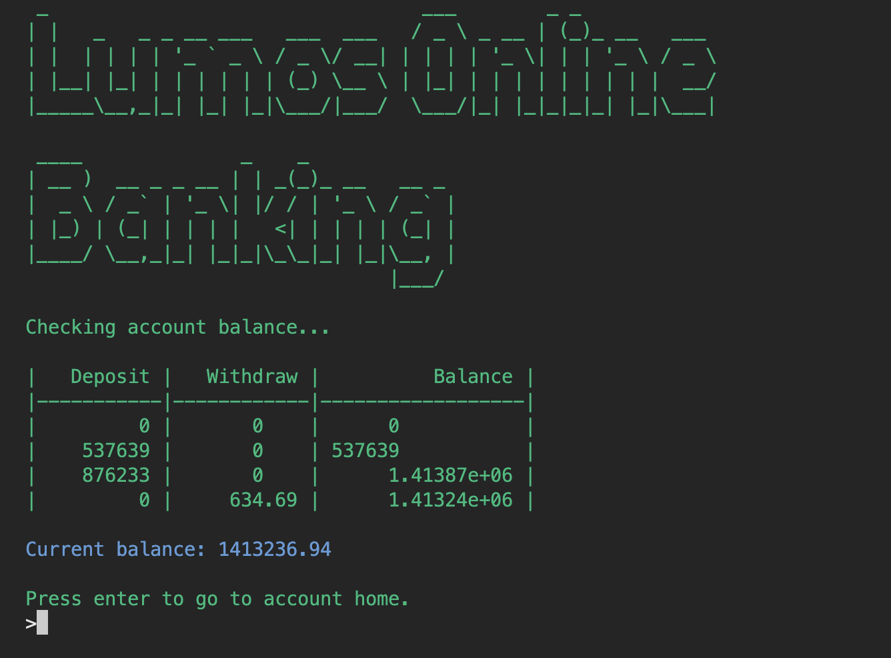
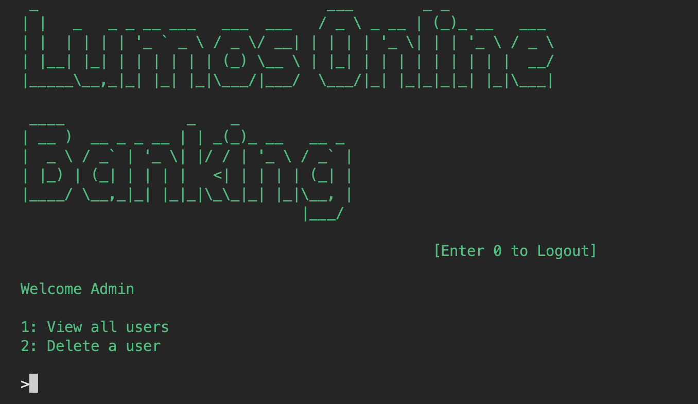
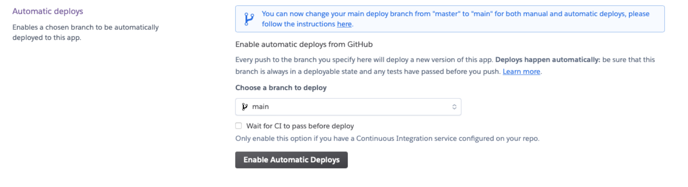

# Lumos Online Banking

Lumos Online Banking is a Python based banking app where users can create an account, login, depost & withdraw funds and delete their account. Admins have access to view all the users on the platform and delete their accounts. The programme uses an external database to store all the user information.

[Live Site](https://lumos-online-banking-698c21a030ae.herokuapp.com/)

## Contents

* [**Project**](#project)
    * [User Stories](#user-stories)
        * [First Time Visitor](#first-time-visitor)
        * [Return Visitor](#return-visitor)
    * [Site Owner Goals](#site-owner-goals)
* [**User Experience (UX)**](#user-experience-ux)
    * [Site Structure](#site-structure)
    * [Flowchart](#flowchart)
    * [Data Model](#data-model)
    * [Design Choices](#design-choices)
        * [Logo]
        * [Color Scheme](#color-scheme)
        * [Tables](#tables)
        * [Slow Typing](#slow-typing)
* [**Features**](#features)
    * [Existing Features](<#existing-features>)
        * [Login](<#login>)
        * [Create Account](<#create-account>)
        * [Account Home](<#account-home>)
        * [Check Account Balance](<#Check-Account-Balance>)
        * [Deposit Funds](<#Deposit-Funds>)
        * [Withdraw Funds](<#Withdraw-Funds>)
        * [View PIN](<#View-PIN>)
        * [Logout](<#Logout>)
        * [Delete Account](<#delete-account>)
        * [Admin Panel](<#admin-panel>)
        * [Admin: View all users](<#admin-view-all-users>)
        * [Admin: Delete a User](<#admin-delete-a-user>)
    * [Future Features](<#future-features>)
* [**Data Model**](<#data-model>)
* [**Flowchart**](<#flowchart>)
* [**Testing**](<#testing>)
    * [Bugs](<#bugs>)
        * [Solved Bugs](<#solved-bugs>)
        * [Unsolved Bugs](<#unsolved-bugs>)
    * [Validator Testing](<#validator-testing>)
    * [Peer Testing](<#peer-testing>)
* [**Deployment**](<#deployment>)
    * [Heroku Deployment](<#heroku-deployment>)
    * [To Fork the Project](<#to-fork-the-project>)
    * [To Clone the Project](<#to-clone-the-project>)
* [**Credits**](<#credits>)
    * [Resources](<#resources>)
    * [Languages](<#languages>)
    * [Libraries](<#libraries>)
* [**Acknowledgements**](<#acknowledgements>)

## Project

### User Stories

#### First Time Visitor

A user visiting the site for the first time will want to:
- create an account
- view their PIN
- deposit some funds
- logout

#### Return Visitor

A returning visitor will want to
- login to their account
- view their balance
- withdraw or deposit funds
- close their account

### Site Owner Goals

As a site owner you may want to:
- have access to an admin pannel
- view all the users and their details in the database
- delete a user

## User Experience (UX)

### Site Structure

The site starts with a welcome page giving you the option to:
- Login
- Create an account

After logging in you are taken to account home where you have the options:
- Check Account Balance
- Deposit Funds
- Withdraw Funds
- View PIN
- Delete Account
- Logout

There is also an admin pannel with the options:
- View all users
- Delete a user
- Logout

### Flowchart

### Data Model

Google sheets was used to store and access user data. 
There are seperatesheets for:
- The customer list
- Each individual users balance

The customer list sheet contains:
- Username
- PIN

The balance sheets contain ccollums for:
- Deposit
- Withdraw
- Balance

### Design Choices

Within the confines of the terminal a few modifications have been made to improve the UX.

#### Logo

The banks logo is displayed at the top of each page. The pyfiglet library was used for this.

#### Color Scheme

The colorama library was used to change the text color in the terminal.
The following colors were used to help the users understand the data and site structure.
- Green: Main site color
- Red: Error messages
- White: User input
- Blue: Account information

#### Tables

The Tabulate was used to disaply data in tables. Data is displayed in tables for easier understanding by the user. The following data is displayed in tables:
- Username & PIN
- Account Balance
- All users

#### Slow Typing

The sleep library was used to delay the speed of displaying some text. This was to allow the user time to process the information. There are two uses of this:
- Delay before displaying a while line of text or information.
- A staggered 'typing' effect when the text is displayed at reading speed.

## Features
### Existing Features

Upon starting the programme the banks logo is displayed and the user is given the option to:
1. Login
2. Create an account

#### Login

When the user selects 'login' they are asked for their username.
They will be show an appropiate error message if thier entry:
- contains any whitespace
- is below 5 characters long
- is longer than 15 characters
- not in the database

If their username is in the database they will be prompted to enter their PIN. They will be shown an appropiate error message if thier PIN:
- not 4 numeric characters 
If their PIN matches the one associated with their account in the databse they are sent to their account homepage.

They can exit the programme at any time by entering '0' or create an account by entering '2'.

#### Create Account

To create an account the user is asked for a username. They are shown an apporpiate error message if their username:
- contains any whitespace
- is below 5 characters long
- is longer than 15 characters
- is already in the database, belonging to another user
If their username is valid: 
- a 4 digit random PIN is generated and displayed to the user
- thier username and PIN is added to the customers sheet in the database
- a worksheet titled with their username ia created and populater with 3 collums:
    - Deposit
    - Withdraw
    - Balance

#### Account Home

When a user logsin they are taken to the account home with the options to:
- 0: Logout
- 1: Check Account Balance
- 2: Deposit Funds
- 3: Withdraw Funds
- 4: View PIN
- 5: Delete Account

#### Check Account Balance

A user can check their account balance and will be shown a table containing all past transactions. Then below the table a final account balance is disaplayed. To return to the account home the user has to press the return key.

#### Deposit Funds

A user can choose to deposit funds into their acccount. They will be prompted for the ammount and that will be added to the database. The user is then shown a confirmation message and sent back to the account home.
The user input is validated and an apporpiate error message will be shown if:
- The amount entered is not numeric
- The amount entered is a negative number

#### Withdraw Funds

The user can withdraw funds from their account. They are shown their current balnace and then asked how much they would like to withdraw. The user input is validated and an appropiate message is displayed if:
- The amount entered is not numeric
- The amount entered is a negative number
- The amount entered exceeds the current balance of that customer's account

#### View PIN

As the user needs their PIN to login and delete thier account and they may not have noted it down upon creating their account, they can view it from the account home.

#### Logout

To keep the users account safe, they can logout which will clear the terminal and send them back to the login page.

#### Delete Account

A user can delete their account, but as this cannot be undone they need to confirm be clicking 'y' and entering their PIN. Once they have done both those things, all the user information is deleted from the database.

#### Admin Pannel

There is an admin account that can view all the current users and delete user accounts. This is accesable from the login page by entering 'ADMIN' as the username and 'password' as the PIN. From the admin pannel there are two options other than logout. View all users and delete a user.

##### Admin: View all users

The admin has the option to view all the users in the database. The data is disapyed in a table with:

- Username
- PIN
- Balance

##### Admin: Delete a user

To delete a the admin is asked for the username of the user they wish to delete then aksed to conform they want to delete the account.
If that is confiremd all the user information is removed from the database.

[Back to top](<#contents>)
### Future Features

- Transfer funds to another user.
- Show only the 10 most recent transactions on account balance.
- Allow users to change PIN.

[Back to top](<#contents>)

## Testing

### Bugs

#### Solved Bugs

- In the welcome function the while loop was not ending after a user had selected a valid option. I needed to add a break statement and calling the next function.
- In the create_account function an infinate loop was created due to the user inout being before the loop.
- I needed to return the pin after it was being crreated for it to be sent to the databse.
- Can create multiple usernames of the same value. Created an if statement inside the create_account function.
- If incorrect username eneterd in login, on second attempt it responds 'Incorect PIN'. Removed unnessisary code after function that was causing part of the function to run again.
- Whitespace can be used in username. Added in an extra elif statement to the create_account function.
- Gspread was showing a error message when I tried to push data to a new spreadsheet insid the generate_worksheet function, using append.rows fixed it.
- The loop in account_home as not ending to I added break to end it when user selects 0. I needed to add a break to the loop in account_home as it was still running from the first time so needed to be closed twice.
- After creating an account and loggin in, the user has to press any selection twice. To fix this I ran the account_home function instead of the login function.
- Deposit function won’t exit on 0, ‘currency’ was referenced before being defined. The type function containing the currency variable was moved into the try statement.
- Deposit not working currency referenced before assignment. Moved the turn_to_currrency function before the type statement.
- Could eneter a negative ammount to deposit. Added in an if statement disallowing it.
- A user could create an account using numbers so I added an elif statement to check the first letter is not a number.
- If you create an account you cannot delete it without logging out and then loggin back in. To fix this I made the user login after creating an account.
- Once the user selected 'create an account' they had to complete it, I allowed them to press 1 at any point and go to the login page.

#### Unsolved Bugs

No known bugs.

[Back to top](<#contents>)

### Validator Testing

- PEP8
    - No errors were returned from [PEP8](https://pep8ci.herokuapp.com/)
    

### Peer Testing

As well as testing myself, the application was tested by the following external users for bugs and userbility.

- Kent Yates
- Selina Sheerin
- Luke Newman

All testers passed all tests successfully without any issues or bugs found during testing! 
The folloiwng tests were carried out.

| Function                    | Test                                           | Result |
|-----------------------------|------------------------------------------------|--------|
| Welcome                     | Enter incorrent value                          | Given error message and chance to try again. |
|                             | Enter '1'                                      | User is prompted to enter their username |
|                             | Enter '2'                                      | The user is asked to select a username |
|                             | Enter '0'                                      | 'Closing application...' is printed to the terminal then it closes. |
| Login: enter username       | Enter username below 5 chracters               | 'User not found, please try again' printed to the termianl and the option to try again. |
|                             | Enter password over 15 characters              | 'User not found, please try again' printed to the termianl and the option to try again. |
|                             | Enter username containing whitespace           | 'User not found, please try again' printed to the termianl and the option to try again. |
|                             | Enter unknown username                         | 'User not found, please try again' printed to the termianl and the option to try again. |
|                             | Enter empty field                              | 'User not found, please try again' printed to the termianl and the option to try again. |
|                             | Enter '0'                                      | 'Closing application...' is printed to the terminal then it closes. |
|                             | Enter '2'                                      | Sends the user to Create Account. |
| Login: enter PIN            | Enter incorrect PIN                            | 'Incorect PIN, please try again' printed to the terminal and the option to try again. |
|                             | Enter empty field                              | 'Incorect PIN, please try again' printed to the terminal and the option to try again. |
|                             | Enter not a number                             | 'Incorect PIN, please try again' printed to the terminal and the option to try again. |
|                             | Enter corect PIN                               | Takes you to Account Home |
|                             | Enter '0'                                      | 'Closing application...' is printed to the terminal then it closes. |
| Account Home                | Enter an invalid selection                     | 'Not a valid selection" printed to the terminal and the option to try again. |
|                             | Enter '1'                                      | The user is taken to account balance screen. |
|                             | Enter '2'                                      | The user is take  to the Deposit Funds screen. |
|                             | Enter '3'                                      | The user is taken to the Withdraw Funds screen |
|                             | Enter '4'                                      | The user is shown their username and PIN |
|                             | Enter '0'                                      | The user is 'logged out' and the terminal window is cleared. |
| Create Account              | Enter a username below 5 chracters             | 'x is not valid. Select a username between 5 & 15 characters." is displayed to the terminal and the user can try again. |
|                             | Enter a username over 15 characters            | 'x is not valid. Select a username between 5 & 15 characters." is displayed to the terminal and the user can try again. |
|                             | Enter username containing whitespace           | 'x is not valid, containes whitespace." is displayed to the terminal and the user can try again. |
|                             | Enter a username beginning with a non letter   | 'x is not valid. First character must be a letter.' Is displayed and the user is given another chance to enter a username. |
|                             | Enter '1'                                      | The user is asked for the username to login and the login function is run. |
| Check Account Balance       | Type any character followed by return          | Takes you to Account Home|
| Deposit Funds               | Enter a non number                             | 'x is not a valid ammount' is printed to the terminal and the option to try again. |
|                             | Enter a negative number                        | 'Withdraw ammount cannot be negative' is printed to the terminal and the option to try again. |
|                             | Enter a number with more than 2 decimal places | The ammount is rounded to 2 decial places, added to the database and the user is taken back to Account Home. |
| Withdraw Funds              | Enter a non number                             | 'x is not a valid ammount' is printed to the terminal and the option to try again. |
|                             | Enter a negative number                        | 'Withdraw ammount cannot be negative' is printed to the terminal and the option to try again. |
|                             | Enter a number higher than the account balance | 'Insufficent funds' is printed to the terminal and the user is given the option to enter a new ammount. |
|                             | Enter the same ammount as the balance          | The full ammount is withdrawn and the user is taken back to the Account Home screen. |
|                             | Enter a number with more than 2 decimal places | The ammount is rounded to 2 decimal places, withdrawn from the databse and the user is taken back to the Account Home screen. |
| View PIN                    | Type anything followed by return               | The user is taken to Account Home |
| Delete account              | 'n' entered                                    | 'Going to account home...' is displayed and the account home panned is loaded.|
|                             | 'N' entered                                    | 'Going to account home...' is displayed and the account home panned is loaded.|
|                             | 'y' entered                                    | User is prompted for their PIN |
|                             | 'y' entered                                    | User is prompted for their PIN |
|                             | Anything else entered                          | 'Invalid selection. Enter Y to delete your account or N to cancel' displayed and the user is given the chance to enter a valid response. |
| Delete account PIN entery   | Incorrect pin entered                          | The user is taken back to account home. |
|                             | Correct PIN entered                            | 'Deleting account... Account succesfully deleted. Logging out...' is displayed and the user is taken to the login page. |
| Admin Pannel                | Type '0'                                       | 'Loggin out...' is displayed then the login page is loaded. |
|                             | Type '1'                 | The user data page is disaplyed containing a table with all the users in the database along with their PIN and balance. |
|                             | Type '2'                                       | the user is prompted for a username. |
|                             | Type an invalid selection | 'Invalid selection. Please try again.' is displayed and the user is allowed another chance to ented a valid selection. |
| Admin view all users        | Press any key                                  | Admin pannel is displayed. |
| Admin delete a user         | Enter a username not in the database           | 'User not found' disaplayed and the option to try again. |
|                             | Enter a username in the databse                | The user is prompted to enter y/n to confirm |
|                             | '0' selected                                   |  'Loggin out...' is displayed then the login page is loaded. |
|                             | '1' selected                                   | The User data screen is loaded. |
| Admin confirm delete a user | 'y' entered | 'Deleting account... Account successfully deleted' is shown and the admin pannel is loaded. |
|                             | 'Y' entered | 'Deleting account... Account successfully deleted' is shown and the admin pannel is loaded. |
|                             | 'n' entered | 'cancelling...' is typed and the admin pannel is loaded. |
|                             | 'N' entered | 'cancelling...' is typed and the admin pannel is loaded. |
|                             | an invalid selection entered | 'Invalid selection' is displayed and the user is prompted to try again.|

[Back to top](<#contents>)

## Deployment
Git and GitHub were used for version control. As Python is a backend language and can't be displayed with GitHub I used Heroku for the live preview.

### Heroku Deployment
1. Login to [Heroku](https://id.heroku.com/login)
2. Click 'New' in the top right and 'Create new app'.
3. Enter a unique application name, select your region and click 'Create app'.
4. Click the 'settings' tab 

5. Under 'Config Vars' click 'Reveal Config Vars'

6. Add the JSPN CREDS file
7. Add PORT 8000

8. Add 'heroku/python' and 'heroku/node.js' to the 'Buildpacks'

9. Click the 'Deploy' tab.

10. In the 'Deployment method' section select 'GitHub'
11. Search for the repo name and click 'connect'

12. Under 'Automatic deploys' click 'Enable Automatic Deploys'

[Back to top](<#contents>)
### To Fork the Project
To make a copy of the GitHub Repository you can fork a copy to edit it without changing the root file. This can then be used to update the original repository. To fork take the following steps:
1. Login to GitHub
2. Go to the repository [DanMorriss/lumos-online-banking](https://github.com/DanMorriss/lumos-online-banking)
3. On the top right-hand side of the page click the `fork` button and save a copy of the original repository to your GitHub account.

### To Clone the Project
To clone the project on GitHub:
1. Click the `code` button  
2. Click the `local` tab
3. Under HTTPS click the clipboard icon to copy the URL
4. In your IDE of choice, open Git Bash
5. Change the current working directory to the location where you want the cloned directory to be made
6. Type `git clone` and then paste the URL copied from GitHub
7. Press enter and the local clone will be created

[Back to top](<#contents>)

## Credits

### Resources

- [Lucidchart](<https://www.lucidchart.com/pages/>) for the flowchart.
- [Github](<https://github.com/>) to store the code.
- [Heroku](<https://heroku.com/>)
- [VS Code](<https://code.visualstudio.com/>) to write the code.
- [Am I Responsive?](<https://ui.dev/amiresponsive>) for the dislay image across devices.
- [Stack Overflow](<https://stackoverflow.com/>) for general troubleshooting.
- [W3 Schools](<https://www.w3schools.com/>) for general troubleshooting.
- [MDN Web Docs](<https://developer.mozilla.org/en-US/>) for general troubleshooting.
- [Google Sheets](<https://www.google.co.uk/sheets/about/>) for the spreadsheet used to store the customer data.

### Languages

- Python was used for the functunality of the programme.

### Libraries

- [gspread](https://docs.gspread.org/en/v3.7.0/api.html) to link up the Google Sheet.
- [credentials](https://pypi.org/project/credentials/) to link the Google Sheet.
- [pyfiglet](https://www.geeksforgeeks.org/python-ascii-art-using-pyfiglet-module/) for the logo.
- [time](https://www.programiz.com/python-programming/time/sleep) for the sleep fuction.
- [colorama](https://pypi.org/project/colorama/) to color the text in the terminal.
- [os](https://www.geeksforgeeks.org/clear-screen-python/) to clear the terminal.
- [random](https://docs.python.org/3/library/random.html) to generate a 4 digit random PIN.
- [Tabulate](https://pypi.org/project/tabulate/) to put data in a table.

[Back to top](<#contents>)

## Acknowledgements

- [Precious Ijege](<https://github.com/precious-ijege>), my Code Institute Mentor.
- [Kent Yates](<https://github.com/Jelly-man>).
- Luke Newman for testing my programme in the most creative ways.
- Selina Sheerin for moral support and userbility testing.
- Stack overflow for continues trouble shooting.
- The Code Institute slack channel for inspiration on features to add.
- Chris SV via slack for testing the programme.

[Back to top](<#contents>)